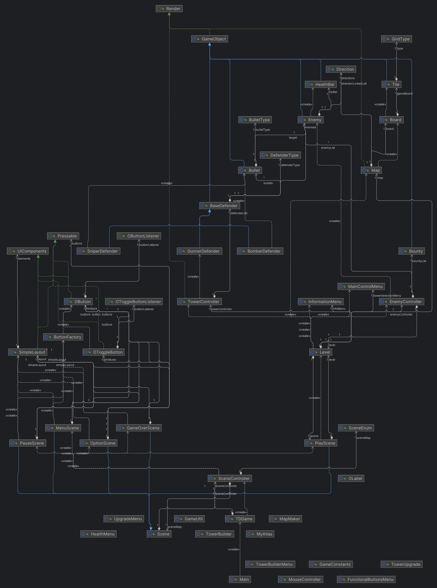
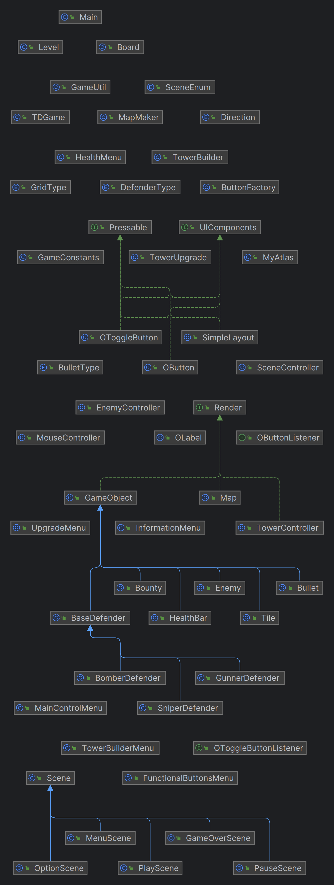

# Rapport – innlevering 2
## Del B
## Prosjektrapport
### Hvordan fungerer rollene i teamet?

- **For det meste fungerer rollene i teamet veldig bra, men tester er noen ganger tungt. Trenger kanskje ekstra hjelp med det.**

### Roller og hva de innebærer

- **Trym | Systemarkitekt**: Rollen innebærer å tidlig finne referansepunkter fra andre prosjekter for å designe vår arkitektur.
- **Tarjei | Support**: Hjelper der det trengs og kommer med nytt innsyn.
- **William | Testansvarlig**: Lager tester der det trengs og hjelper til hvis noen trenger hjelp.
- **Kevin | Design og UX**: Designer teksturer og UI (skaper en god brukeropplevelse).
- **Egor | Prosjektleder**: Har kontroll innenfor prosjektet, sånn at hvis andre spør om hjelp så kan han hjelpe. Har oversikt over oppgavene og innleveringsdatoene. Passer også på flyt og jobbing i prosjektet.

### Erfaringer verdt å nevne

- Peer programming har vi testet ut og det fungerer bra. Men XP-metodikken fungerte dårlig, da vi ikke er gode nok til å skrive tester.
- Issueboard har vi vært dårlig til å bruke, men tenker å bruke det mer i fremtiden.
- Vi har skrevet Javadoc for det meste etter vi er ferdig, men vi bør bli bedre på å skrive det underveis.
- Teamet fungerer bra, men vi er litt dårlige på å komme i gang, men når vi først kommer i gang klarer vi å holde flyten oppe.

### Gruppedynamikken

- Gruppedynamikken fungerer bra når vi jobber fysisk sammen, men vi har ikke testet hvordan det fungerer å jobbe individuelt.
- Vi kom litt dårlig i gang på grunn av mye sykdom i teamet i starten av prosjektet.

### Kommunikasjon

- Kommunikasjonen fungerer bra både fysisk og på nettet, men beskjeder kommer litt sent.

### Kort retrospektiv

- Hvis vi bruker issueboard mer aktivt kan man hjelpe seg selv og hverandre på å ha en bedre oversikt over prosjektet.
- Det som har fungert bra er peer programming og sam-programmering.

### Kodebasen

- Kevin jobber med design og sitter derfor mye i Photoshop. Han jobber også med sitt eget prosjekt i et testmiljø.
- William bruker mye tid på å gjøre seg kjent med prosjektet for å lage tester.
- Tarjei hjelper ofte og det kan skje gjennom par-programmering og det vil derfor ikke gjenspeiles i git-historikken.

### Referater
[Arbeidsøkter](Arbeidsøkter 04.03-08.03.pdf)  
[Møtereferat 5](Møte 5 referat 08.03.pdf)

### Forbedringspunkter

- Vi kan forbedre oss på å bruke issueboard oftere.
- Bedre planlegging av møter og arbeidsøkter.
- Bedre kommunikasjon av det som skal gjøres.

## Krav og spesifikasjon

### Prioriterte krav og MVP

- Fra vår [MVP](oblig1.md) har vi fått gjort følgende:
    - Vise spillbrett
    - Plassert forsvarer ved hardkoding
    - Plassert angriper ved hardkoding
    - Spiller kan dø
    - Game start screen (trenger redesign)
    - Game Over screen (trenger redesign)
    - Quick Reset funker
    - Beskytter gir skade på angriper
- Vi er ikke helt forbi MVP ennå, da noe av funksjonaliteten vi hadde som mål ikke er laget helt ennå.
- Vi prioriterer nå ny funksjonalitet gjennom brukerhistorier som vi har fått skrevet skikkelig.

### Hvordan oppgavene har blitt prioritert

- Vi ønsker å fjerne hardkoding av fiender og tårn. Dette krever en form for UI, så dette vil også være en prioritet. Vi ønsker å vise level stats, slik at spilleren har en oversikt over hvordan hen ligger an.

### Justeringer fra MVP

- Vi har valgt å dytte punkt 4 og 9 bak i prioritet, da disse ikke implementerer mye ny logikk, men heller bare viser frem tall som vi i stor grad allerede har tilgjengelig i vår kode.

### Krav som har blitt prioritert

- Vi har til nå prioritert følgende krav:
    - Defenders
    - Enemies
    - Stats
    - Options
    - HowToPlay
    - UI.
- Hittil har vi i stor grad fullført følgende:
    - Backend for: Defenders, Enemies, Spillbrett
- Vi vil derfor fremover prioritere å lage en UI, HowToPlay, options i meny og fremvisning av stats.

### Bugs

- Bugs vi har utbedret:
    - Forsvarerens angrepsradius ble ikke overholdt.
    - Angripere beveget seg vertikalt i en tiles bredde, og horisontalt i en tiles høyde.

## Produkt og kode

### Utbedring av feil

- Sist innlevering var vi fortsatt i startfasen i prosjektet, vi har derfor fokusert på å produsere mer kode. Vi hadde derfor ikke noen konkrete feil vi ville utbedre fra sist innlevering.

### Klassediagram
  

### Kodekvalitet og testdekning

- Hittil har vi fokusert på å få ned basisfunksjonene. Vi er i et mellomstadium der vi holder på å rydde opp grunnstrukturen for å forbedre kodekvaliteten. Vi har lagt litt fokus på bruk av datastrukturer og Java-dokumentasjon.
- Når det gjelder tester, har vi begynt med tester for basisfunksjoner som finnes i akseptansekriteriene.

### Statiske analyseverktøy

- Vi har ikke fått tid til å teste disse verktøyene ennå, men vi satser på å få gjort dette til neste innlevering.

### Slette filer/kode

- I vårt prosjekt har vi nå implementert en midlertidig UI, som benytter seg av et knappesystem som vi ikke tenker å bruke på sikt. Kevin holder nå på å gjøre seg kjent med libGDX sitt eget knappesystem, slik at vi kan implementere dette i vår UI. Vi har foreløpig det gamle knappesystemet lokalisert i UI-mappen.

## Bruker Historie

### Defenders
**Som spiller har jeg lyst å velge flere tårn og velge selv hvor de skal stå ut i fra en “menu” når jeg spiller.**

**Akseptansekriterier:**
- Velge tårn fra en “menu” i “playscene”.
- Ha flere tårn å velge mellom.
- Tårn skal kunne plasseres hvor som helst på board (uten om path).

**Arbeidsoppgaver:**
- Implementer en UI menu for tårnene.
- Implementer flere tårn.
- Implementere “drag and drop” for å plassere tårnene selv.

### Enemies
**Som spiller vil jeg at enemies skal bli vanskeligere og vanskeligere å drepe for hver wave som kommer og det kommer forskjellige typer enemies.**

**Akseptansekriterier:**
- Ha en multiplikator for hver wave som gjør at flere enemies spawner.
- Ha en multiplikator for hver wave som gjør at enemies får mer “HP”.
- Ha en “randomizer” eller at det spawner flere typer enemies.

**Arbeidsoppgaver:**
- Implementere en multiplikator som baseres seg på hvilket wave du er på.
- Bruke multiplikatoren til å spawne mer enemies med mer “HP”.
- Implementere flere typer enemies.
- Implementere en bedre spawner som klarer å gi forskjellige typer enemies.

### Stats
**Som spiller vil jeg kunne se mine stats, hvilken wave jeg er på, hvor mange liv jeg har igjen, hvor mange enemies jeg har drept og hvor mye penger jeg har til å bruke på nye tårn.**

**Akseptansekriterier:**
- Ha en “top-bar” med stats. På den skal vises:
    - HP
    - Wave
    - Penger
    - Enemies drept

**Arbeidsoppgaver:**
- Implementer en “top-bar”.
- Implementer spiller liv, Wave counter, Penger, Enemies drept.
- Kalkulere resterende spiller liv ut i fra hvor mange enemies som har kommet til slutten av stien og trekker fra liv basert på det.
- Kalkulere penger ut i fra hvor mange enemies som er drept.
- Implementer at tårn koster penger og ikke kan plasseres hvis du ikke har nok.

### Meny
**Som spiller syntes jeg at spillet ser mer spennende og vakkert ut med en fin meny.**

**Akseptansekriterier:**
- Bedre design på “Main menu”, knapper skifter font/farge/bakgrunnsfarge når musen er over den og trykket.
- Når du trykker på en knapp så gjør den noe, skifter scene eller viser options…

**Arbeidsoppgaver:**
- Implementere bedre design på “Main menu”.
- Implementere bedre knapper med funksjoner og responsive feedback (skifter font/farge/bakgrunnsfarge).

### Options
**Som spiller vil jeg kunne bestemme om spillet skal være i fullskjerm eller ikke:**

**Akseptansekriterier:**
- “Main menu” har en “How to play” scene som gir en intuitiv forklaring på hvordan man spiller spillet.
- “Options” har en fullskjerm og en vindu-modus sånn at spiller kan velge selv hvordan han vil spille.

**Arbeidsoppgaver:**
- Implementer “How to play” scene.
- Implementer inne i “How to play” en oversikt og beskrivelse av spillet.

